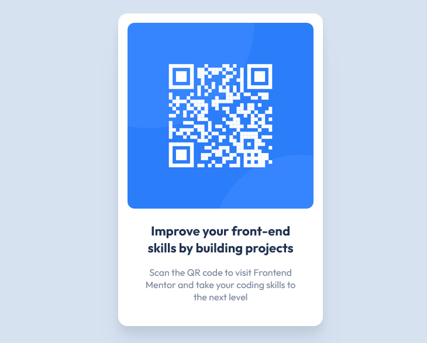

# Frontend Mentor - QR code component solution

This is a solution to the [QR code component challenge on Frontend Mentor](https://www.frontendmentor.io/challenges/qr-code-component-iux_sIO_H). Frontend Mentor challenges help you improve your coding skills by building realistic projects.

## Table of contents

-   [Overview](#overview)
    -   [The challenge](#the-challenge)
    -   [Screenshot](#screenshot)
    -   [Links](#links)
-   [Author](#author)

## Overview

### The challenge

The challenge is to build out a QR code component and get it looking as close to the design as possible.

### Screenshot

### Links

-   Solution URL: [QR Code Component on Netlify](https://cheery-alpaca-3ffdea.netlify.app)

## Author

-   Frontend Mentor - [@davejnicol](https://www.frontendmentor.io/profile/davejnicol)
